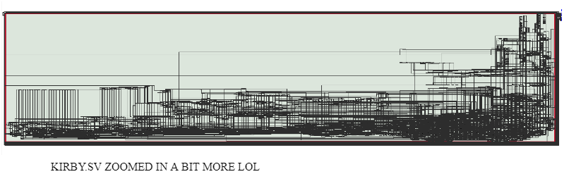

Our project for ECE385 is a basic Kirby game. This project was written almost entirely in System Verilog. We used the DE2-115 board. The timeframe for this project was just under a month. The world is lef/right scrollable. There is one basic enemy on the startup. Upon reaching the door on the top, Kirby enters into the boss room. We didn't have time to fully define our health system. Kirby only has one move which is to shoot a star across the screen.

We used the 2MB SRAM for backgrounds and OCM for sprites. FLASH to hold the sound memory but we were unable to fully get our written driver to fully function correctly. 8 bit color depth was chosen since 16 bit SRAM bit width allows 2 potential image storage per address. Python code (which we adjusted for case) to sample our images were used courtesy to Rishi who wrote it from previous years. We also created some rather simple python code to output some repetitive aspects of our code. The keyboard interfaces with the NIOS system and written in C. This code was mostly provided to use but we tweaked to enable a maximum of 4 simultaneous keypresses. 

The game will have two levels of different environments where the player can control the movement of the kirby character in all four directions. There will be an enemy in the first level and a boss in the second level. Kirby can attack the enemy or the boss by spitting a star that will travel in the horizontal direction it is facing, even though collision detection was not implemented between the Kirby/its attack and the enemies. Kirby’s health will be displayed on the Hex Display of the DE2 board. The background environment of both levels are designed with nontrivial boundaries that could block Kirby’s movements. Both environments of the gameplay are designed to be larger than what is displayed on the VGA for the purpose of implementing the scrolling of the screen in the horizontal direction. Namely, the VGA initially only displays the left portion of the background environment. As Kirby moves towards the right reaches the right edge of the currently displayed background on the screen, the displayed background image will be scrolled to the right if Kirby continues to move to the right to remain the same display size, but hiding some part of background on the left and unveiling some hidden portion of the background image of this level until it reaches the actual right edge of the background image. Similarly, if Kirby moves to the left and reaches the left edge of the currently displayed background on the screen, as long as there is an undisplayed portion of the background image on the left, the displayed background image will be scrolled to the left. The enemy figure in the first level has an automatic horizontal movement back and forth with a certain range, while the boss figure in the second level has both horizontal and vertical movement. The player can get to the second layer through the transport gate on the top. 

The realization of the VGA display for background and characters depends on the structure and storage of the corresponding images, as well as our pixel access mechanism. We have grouped character images that correspond to all frames of different actions for each character into one sprite sheet. Please refer to details of the keypress and corresponding character action in the written description. We have chosen to store the background image in SRAM and  character (Kirby and enemies) sprite sheets in on-chip memory. Our implementation of character (kirby and enemies) movements is mainly based on the algorithm for ball movement in lab8. This means that we also inherited the code for both USB keyboard interface and VGA interface. 

## DESCRIPTIONS MORE IN DEPTH

- COLOR - We chose to use 8 bits of depth for color mainly because we value aesthetics. The SRAM also was 16 bits wide which is exactly twice the width of the color depth allowing two images to be stored in a SRAM location at any given time. We didn’t need to use that method but it was a way to expand upon if we had enough time. 

- We generated the .TXT and .RAM files courtesy to RISHI’s ECE385 Helper Tools in which we also made some modifications to fit our needs. 

- GRID - A Grid format was utilized to map out our project. The map and characters are composed of 32 x 32 cells. For one (height by width) 768 by 512 there are 16 cells for the columns and 24 cells for the rows. An early grid design is shown below. They were created in photoshop. Almost all the images were ripped from spriters-resources.com which is free to use but credits for the original designs of course come from Nintendo. Most images go through a bit of lossy compression to fit in the 32x32 square. RISHI’s Helper Tools allowed us to put the colors of our chosen images into 8 bits. Additionally, we also went into paint and exported the files as 8 bit colors.

- UNIT BLOCK IDENTIFICATION - Each 32x32 unit block or any sized block in general is referenced by the top, left corner. Additionally, the standard order of retrieving each block is pixels from left to right and top to bottom. Starting from the left side of our gameplay screen, each block was declared as a 32x32 block but that became excessive so the blocks were  declared in much larger chunks on the right side of the first screen and also the boss backgrounds. 

- ANIMATIONS -  In order to create the animations for Kirby and the like, we simply oscillated a series of  images at an interval which repeated. Particular strong moments were accentuated by giving that image a moment more time. They are not hardwired straight on as FSMs. Rather counters are used to count the CLK (in our case is the CLK_VS) clock and a modulo is used to increase the interval of time. We found that intervals of 8 worked very well.  Simplified example sequences are shown below. (Note that duplicates are not included)

- ANIMATION MIRRORING - To conserve space, we stored all of the images in one orientation (Left or Right) and then mirrored the images when wanted the character to face the opposite direction. We read the pixels of each 32x32 block by right to left instead of right to left (both still top to bottom).

- MOVEMENTS - Motion was created using ball.sv as a starting point from lab8. We threw away all the velocity and motion related things and directed controlled the positions which incremented or decremented by certain values per clock cycle. 

- OVERLAP - We achieved overlap in images by using “priority levels”. The first layer regardless of color is the background. Sprites can be drawn on top of that layer. A lighter green color in the grid to be “see through”. Therefore, none of the sprites can have that color.  In the VGA module, if the sprite block was active on a pixel, it is checked if that pixel was “green” or “see through”. If it was green, it was discarded and the background under it is not redrawn. Some of these in our case are arbitrary. For example, the boss and waddle_enemy are always on separate layers.The priority levels are as follows:
  - 1) kirby, 2) kirby_attack, 3) boss_enemy,  4) boss_attack, 5) waddle_enemy

- KIRBY_ATTACK- For this project, we only implemented Kirby with a basic attack launching a star for its mouth. Kirby can only launch 1 star at a given time and must wait until the star collides with an edge of the screen until it can spit out another star. To implement this, a block is overlaid under Kirby constantly. It does not appear until the key (A) is pressed. The direction the star traverses depends on the direction Kirby is facing. After the key is pressed, a counter is used to increment through the four images of a rotating star.

- BOSS FIRE ATTACK - The Boss (Batafire) has an instance where it fires three fireballs in various directions. The directions are not random(cause we got lazy). Technically, we could have implemented almost the same way as the Kirby attack. When the fireballs are inactive, they are actually positioned beyond the screen on the bottom and at the start of that attack sequence, the three fireballs position change to the the center of the Boss. There is a counter in which each of the three fireballs are shot out at different angles and change directions a maximum of 4 times(decided by the FSM). Each fireball moves 7 pixels at a time and oscillates through 4 images to give it an illusion of motion. When the fireball hits an edge, its position immediately comes back to the center of the Boss and repeats for the duration of the Boss Fire Attack. 

- MAP TRANSITION FSM - The game starts off with “Kirby’s House” and when you make your way upstairs to the door, you go into the boss room. It’s a basic FSM that triggers when the Kirby block overlaps with the door block. 

- CHASING KIRBY BOSS STATE - The Boss chases Kirby basically by comparing its position with Kirby’s position and choosing movements that reduce the distance between the two. Returning to the center is basically the same thing but relative to the center of the map instead of Kirby. 

- OBSTACLE DETECTION - Since we utilized a fixed frame approach, relevant edges for blocks were hardcoded so that when the Kirby block is about to overlap, a signal such as (NO_DOWN, NO_UP, NO_RIGHT, NO_LEFT) which the movement FSM uses to limit Kirby’s motion. 

- SCROLLING LAND - Basically, there are 2D effects which gives a sense that you can navigate through a landscape. The way we have it set up is that the screen is already the leftmost position so you can’t move any more left than the starting screen. The green square represents the area that the computer screen can “navigate” which is marked with a reference line with an imaginary fixed position. The movement of the green square gives the perception of a moving landscape on the screen The red line helps keep track how much we can move the green screen in the back. We arbitrarily assigned it to 500. We can move the reference line and thus the green background boundary conditions. If Kirby is touching the edge of L1 or L2, and the reference line can still move in the opposite position to Kirby’s motion, Kirby stops moving on the screen while all the objects in the background move in the reverse direction. 

- ROTATING BACKGROUND SKY - This effect is simply manipulation of reading the block with the sky. There are counters that increase an added offset from 0 to the length of the block containing the sky which repeats giving the illusion that the sky is moving. Additionally, we photoshopped the sky to wrap around perfectly. 

- MULTIPLE KEY PRESSES - We give props to KTTECH which has a simple guide on reading four keys at once. Since the given C code allows for 4 keys to be read simultaneously already, we just needed to pick up those extra signals. This was achieved by extending the datatype holding that data from 1 to 4 keys and extending the PIO bits to be large enough to be able to receive them. 

- KEYPRESSES AND THEIR ANIMATIONS - Keypresses are linked to Kirby animation images. For example, If I press the D key, I expect that the Kirby animation will show Kirby walking forward in addition to actually forward on the screen. Counters and tricks with the modulo are used to create the animations. There is a register that holds the previous keypress and compares it to the current keypress. The corresponding counters increment only if the previous and current presses are the same or else they go back to 0. There is a default animation for Kirby not in the still state. Kirby’s Y coordinate always increases to simulate some gravity unless the up key is pressed. Double key presses are registered in the case of (U & R) and (U & L) but in those cases, the U animation overrides the L and R animations. The direction Kirby faces is noted from the last press which is either (L or R). The attack key(Enter) also works with simultaneous presses.

Written Description
1. Gameplay System
  - Step1: Platform Designer is used to define PIO’s such that the NIOS II is able to interface with System Verilog hardware I/O wrapper to control the CYC67200 chip which manages the USB I/O. There is a PIO for each task the USB manages which includes the: address, data, read, write, and chip select. 
  - Step2: This involves piecing the top level entity together in Verilog with the provided code such as the color mapper and vga_controller and ball and connecting them to the proper I/O pins.
  - Step3: The hardware I/O wrapper in System Verilog is defined to handle the connections between the PIO’s coming from the NIOS II processor to the CY7C67200 chip. This also includes a tri-stated data bus. 
  - Step4: Here, we interpret the given timing diagrams for the Host Port Interface read and writing cycles. 
  - Step5: The single read and write of data from the CY7C67200 chip is defined. 
  - Step6: We take care of providing the correct conditions for the movement of the ball upon the screen edge and key command conditions. 

## Module Description
1. Kirby.sv
  - Description: This file includes an FSM that has boundary checking of the Kirby character with each block of the background.
  - Purpose: Implement Kirby’s movement, action palette selection and boundary checking
2. Color_Mapper.sv
  - Description: This module assigns a color (consists of R, G, B values) to every pixel. Specifically, we assigned the color out of 256 different colors for any pixels using the passed-in index.
  - Purpose: The purpose of this module is to assign the correct color to each pixel so that we can draw it on the VGA monitor. It is used to draw the screen with the characters and background.
...

## BUGS/EXPLORATIONS/ATTEMPTS/FAILURES?
- When we initially started, we contemplated many ways to implement our game. We were extremely interested in trying to put everything in SRAM and for each pixel, we would read 4 times for each pixel. Therefore we would theoretically have 4 layers of overlap and much faster compile times since we would not have to use OCM which has slow routing times. 
  - However, we ran into many issues. Although the access time for SRAM  can at best be 20ns that is “at best”. We suspect that we had many timing problems, and delays that caused serious fuzzy images. We were able to read the SRAM from twice for one pixel but that also caused a bit of haziness as well. Strange observations with multiple readings per pixel are shown below.
  - We also attempted FLASH memory alongside SRAM. We were able to successfully pull data from FLASH but access times were not fast enough. The pic below shows spaced lines in between our images. This makes sense since FLASH required around at least 90ns of access time and we were interested in closer to half of that. A sample image access from FLASH is shown below. 
  - We also had a problem with Tim’s laptop that generated .RAM files incorrectly for some strange reason which took days to figure out. We ended up generating all the .RAM files through Linux on FASTX. 
  - After hardcoding half of the map in place, we realized that there would be problems at the top and left edges of the screen. Those edges are defined as zeros. There would be interesting problems in which if an attack hit those edges, they would just seemingly vanish. The problem is that when we allow some movements to move more than 1 pixel at a time so there are changes in which the movement briefly moves beyond the 0 line. Verilog has no direct distinction for a negative number so 00 - 01 would be 11 which makes the object “shoot far into the opposite direction”. There is also a similar problem when we have a scrolling background. 
    - We think that the best way to fix this problem would be to originally have an offset such that the ‘0’ edges would be defined as a larger positive number but we did not want to have to change a lot of code so we 1) defined the ‘0’ edge to include a portion so the largest numbers or 2) we created a boundary that was offset so such a situation would not occur. 
  - An interesting circumstance that came about was the tradeoff between having separate modules to keep code clearer. However, if the wires may be confusing with more separate modules. But then again, if you had one large module like we did, it became incredibly difficult to locate things within that module. 
  - We made an attempt with creating our own interface with the Codec Audio which was not functional. We believe that the I2C interface is functional as we could hear random junk noise but not expected tune. Therefore, we suspect the I2S. We mainly didn’t understand the BCLCK pin and how much to pad the data for each of the channels. The functional I2C for 1 cycle is shown below. 

The I2C is shown below. The data input works correctly. It is possible that we did something wrong here. We did not 0 pad since we thought it was unnecessary. For simulation purposes AUD_BCLK was set 1:1 ratio to AUD_XCK when it is set to 1:384 for usage.  

## Conclusion
We only managed to implement a portion of what we expected in the final project proposal mainly because we have encountered significant bugs and inconvenience in debugging after the midway checkpoint. We were able to achieve basic screen scrolling and Kirby movement with a simplified background instead of making our final sprite sheet. However, we did not expect certain bugs coming up when we actually switched over after the midpoint. The issue with SRAM and glitchings significantly hindered our progress and we had to hardcode boundary detection for each block, causing an excessive amount of compilation time as well. 

Demo: https://youtu.be/6eeaDSD7yt0

Do not plagiarize.
