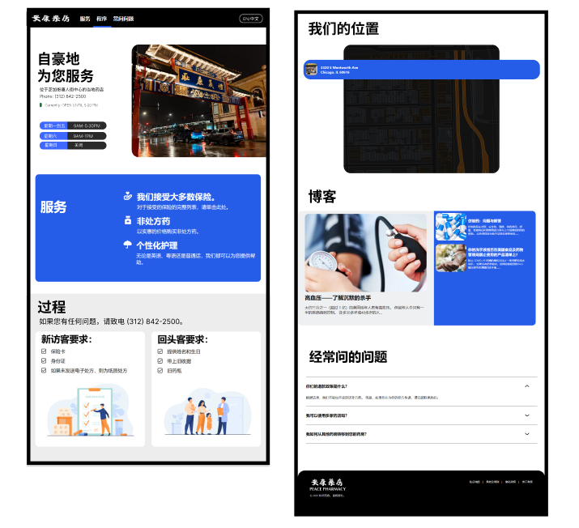
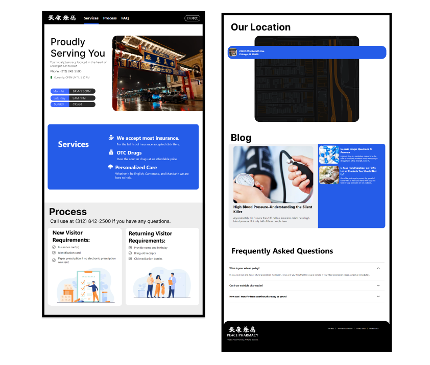
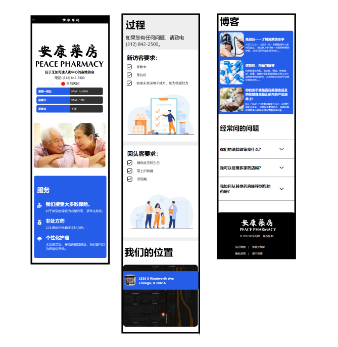
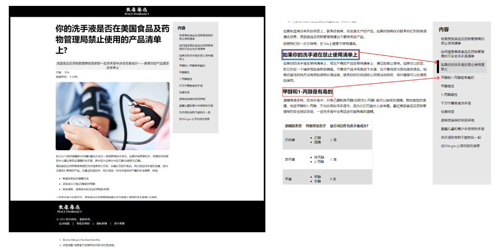

The objective was to create a basic web page of Peace Pharmacy just to provide basic information that could be extended upon in the future. The page can be accessed at: [chicagopeacepharmacy.com](chicagopeacepharmacy.com). One of the main requirements was that it needed to be displayed in both English and Chinese. Most of visitors at the pharmacy spoke mandarin or chinese. The main advantage of this pharmacy seems to be the fact that the employees were able to speak chinese and the prescription labels had chinese. The basic requirements that I came up were: 
  - Text was in Chinese and English
  - Provides basic information about services offered such as business hours, phone number, requirements
  - Decent Mobile and Web interface.
I decided to have the language default to Chinese and added a blog section for additional content.
I'm not a designer my any means but I tried my best to make the page as aethetic as possible. The Chinese web version is shown below. 

One thing that I learned as I wrote the webpage was that the aesthetic of the page can drastically change based on the language. A long piece of text in English could be shorter, or longer in Chinese and makes it look awkwards. The converse is also true. The language styles of the fonts and line heights could also be an awkward transition. I tried to make it look the best in Chinese first. 

The mobile version is shown below. 

The blog is generated from markdown text. The language depends on the url. chicagopeacepharmacy.com/blog/language_abbreviation/article_name. The sticky sidebar conveniently keeps track of the current viewing section implemented using the intersection observer api. 

