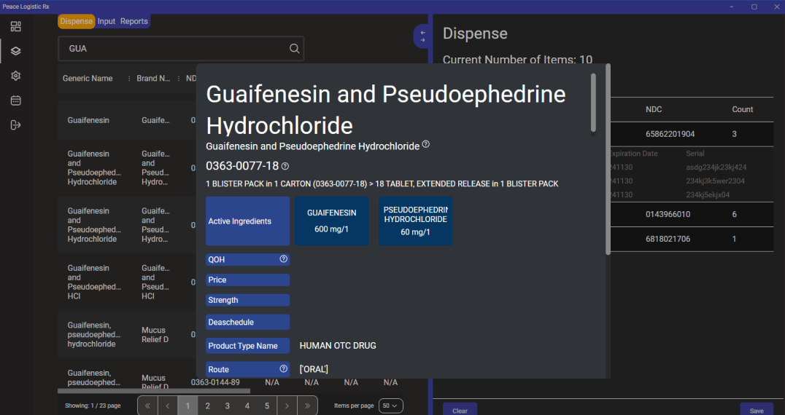
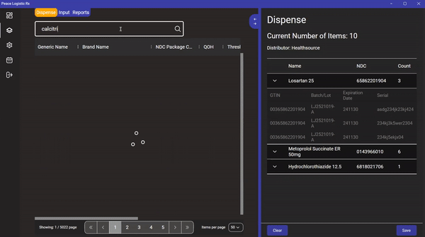
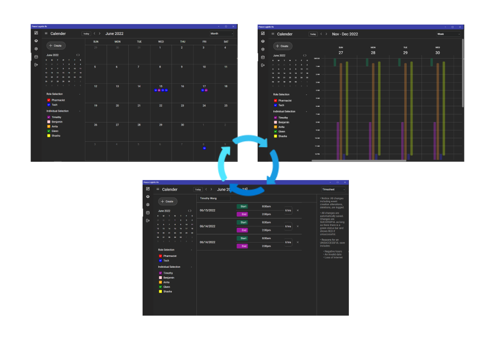
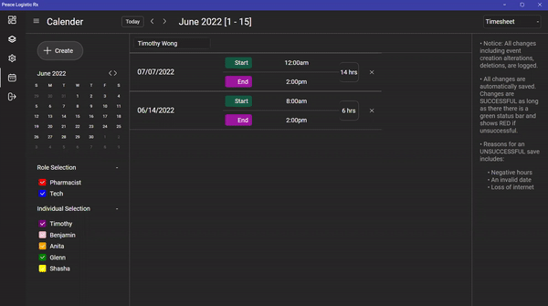
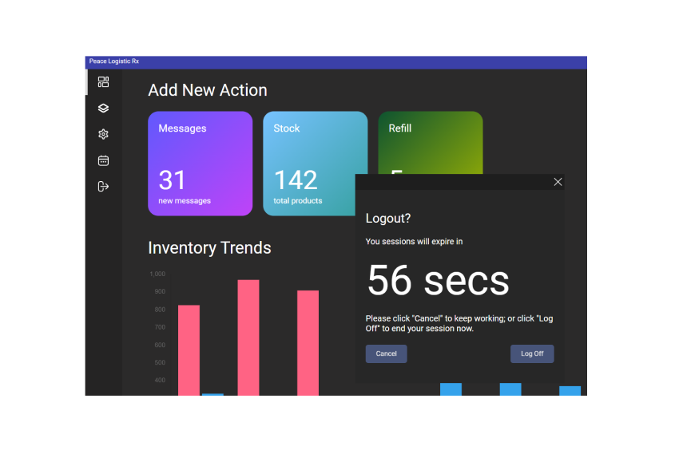

Tracking the inventory of prescription medication is important in to regulate from both a financial and safety standpoint. Traditionally, inventory is done by hand but modern software in the healthcare industry have made it more automated. All pharmaceutical products in the use are mandated to have 1d barcodes containing a National Drug Code(NDC) which is a unique product identifier for drugs intended for human use. The NDC is a unique 11-digit, 3-segment can be in one of the 3 configurations: 4-4-2, 5-3-2, or 5-4-1. The partitioning representing the labeler identifier, the product code, and the package code. A newer standard for medication mandates an additional GS1 barcode which is a 2D barcode that in addition to the NDC encoding, also contains information on the expiration date, batch number, and serial number. 

Most pharmacy systems use just the 1d barcode. This was the impetus for this project to create inventory system for medication using the GS1 barcode to manage inventory and medication expiration dates.

I also wanted to create a time tracking system of employees. 

The application uses the Electron Framework. I chose it mainly because it of its advantages of being able to work across different platforms and my already somewhat familiarity with web technologies. I used React with Typescript over the framework and Redux as the state manager. The backend utilizes NodeJS and PostgreSQL running on docker containers. 

The data I used came from the openFDA. I downloaded their NDC and labeling data. I cleaned and combined the data into one single table with ~22k entries with some Python scripts. There were quite a bit of descrepencies. The information was not standardized between different manufacturers. There descriptions, naming, and formatting sometimes differed from each labeler. Additionally, I'm not sure if it was due to mistakes or maybe reusing the NDCs of discontinued drugs but there were around 15 NDC duplicates in the data. 

## User Interface

The user interface consists 4 main pages navigatable using the left sidebar: Main, Inventory, Settings, Calender. When users launch the application, they are greeted by signin, signup page. Upon being successfully logged in, the application full screens and opends up the main page. 

The application for the most part does not use any UI libraries besides the inventory graph on the main page which uses the bar chart from react-charjs-2. I envisioned a sleek, modern feel to it. The main page would present basic statistics about the inventory, such as the number of added or removed items over a specific time period on the graph. The widgets above would ideally show the number of inventory that was or nearing expiry. 

The Inventory page is the most imporant page. It is partitioned into two sections. The left section normally displays the searchable drugs to be added into the system. Drugs could be searched by name, a barcode scanned NDC code or the GS1 datamatrix barcode. The items scanned or selected are staged on the right section to be added or dispensed from the database. 

When you click on the item, a popup shows the item descriptor. 



A demonstration of the search is shown below.




The purpose of the calender page is to track the working hours of employees of a pharmacy. The UI heavily resembles the UI of google calender which I drew my inspiration from. The calender page goes between 3 pages selectable with the top right dropdown. It navigates between Month, Week, and Timesheet. Month displays the current month and a circular icon with the worker's initials if they work on that particular day. The week shows the working times of a certain week and the Timesheet shows the worked times over a certain timeframe. Currently the time period for this section is bimonthly so days 1-15 to 16-{end of the month}. 



The current calender implementation calculates and generate a calender for 1 full year and fetches all activities from across an entire year. So for example, if the date is currently March 01, 2022, if I toggle to the neext couple of months like April and May, the calender generator does not have to do anything. It does have to regenerate the calender and events if it travels between December 2021 to January 2022. Similar to Google calender, events can be added in the Month section be clicking on the particular calender day or pressing create event from the ceate icon. Currently, the Week section is only view only so you cannot create or change events from that section. I ran into issues with lag with the Week View. It lags when you collapse the left sidebar. I think this happends because the Week View implementation creates a couple of divs for each hour so 3*24hours*7days makes for a of divs that needs to rendered or rerendered. 



The last icon on the left navigation bar is the logout prompt. Upon a click, a popup displays regardless of current page and counts down from 60. You have the option to cancel or logout immediately. If the countdown hits 0, the application automatically logs out and closes.



## Problems
 
A long the way, I learned that drug labeling had a lot more complexity than I thought. Healthcare regulation and pharmaeceutical regulation varies greatly between countries. Currently, the implementation of GS1 DataMatrix barcodes are still being rolled out in many countries. In the US, many companies have opted into these standards already but I do not think there is no official requirement to include a GS1 barcode. The only mandate seems to be that medication must contain the NDC and its associated barcode. Additionally, over the counter(OTC) drugs are not required to have a barcode and the barcode that they have are UPC barcodes. Some medication are available both as prescription and OTC which is problematic. Some drugs also can switch between being either depending on the dosage. 

## What I Learned

I learned that a large project gets really confusing to navigate and the importance and good folder structures. Also, as the project becomes large, the building time takes a lot longer so testing sections in isolation becomes invaluable. 

In terms of technical learning, I learned about debouncing and throttling when I was implementing the search functionality. It's like a debounced switch where you would use it to prevent the non-ideal behavior of a switch to "bounce" several times when its flipped before reaching to a staedy state. My understanding of throttling and debouncing is that:

- Throttle: function will be called at max 1 time over a specific period.
- Debound: function is called after the caller stops calling the function after a specific period. 

So in this situation, I fould that it is advantageous from a rate limiting perspective to debouce calls to the search api. The api is called only after a small pause in typing rather than anytime the typed word changes. I used the debounce function from lodash rather than implementing that myself. 


```javascript
  _.debounce = function(func, wait, immediate) {
    var timeout;
    return function() {
      var context = this, args = arguments;
      var later = function() {
          timeout = null;
          if (!immediate) func.apply(context, args);
      };
      var callNow = immediate && !timeout;
      clearTimeout(timeout);
      timeout = setTimeout(later, wait);
      if (callNow) func.apply(context, args);
    };
  };
```


