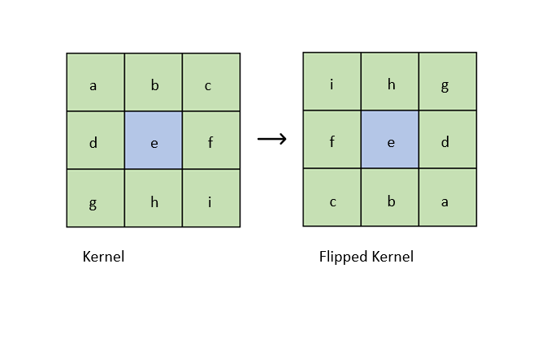
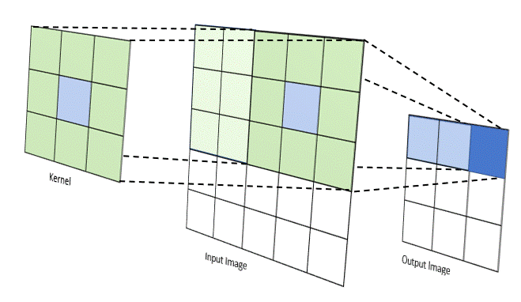
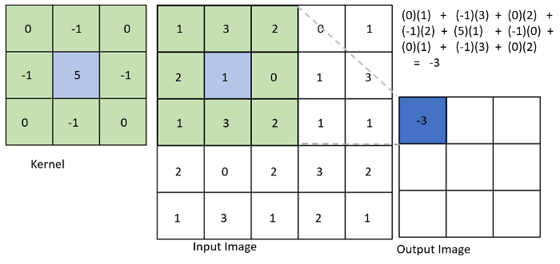
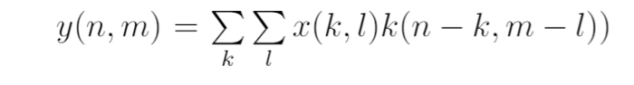
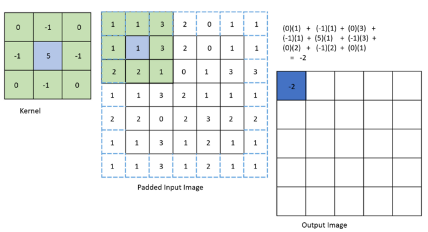
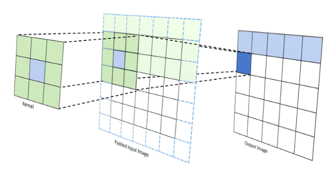
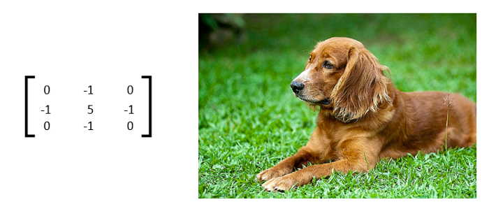
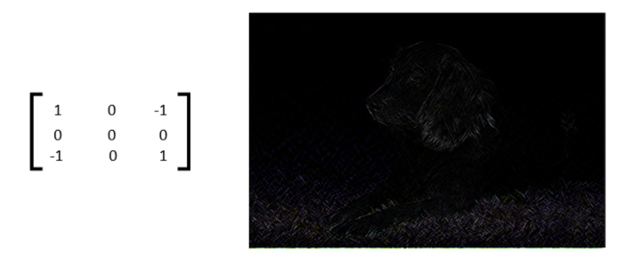
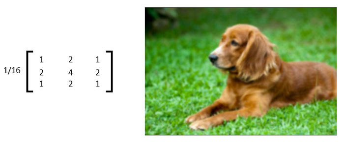

# Image Convolution Filtering

Convolution is one of the most important concepts in signal processing and a precursor topic to understanding Convolutional Neural Networks. There is a lot of complex mathematical theory that can be explored. In basic terms, a convolution is a mathematical operation on two functions that produce a third function. In this article, we explore an application of convolution in the realm of digital image processing.

Just to review a bit. Digital pictures are represented by pixel values. The typical format for storing pixels is by byte or eight bits. 8 bits can store 2⁸ amount of information. Grayscale images have 1 channel that goes from a scale from 0 to 255 where 0 is black and 255 is white. Colored images typically have 3 channels and stored as 3 bytes: red, green, blue (RGB) values each ranging from 0 to 255 depending on intensity. Therefore, a picture can be represented as a matrix of values. The illustration below reveals pixels as one zooms into the photo of Mr. Musk.

In image convolution, involves a kernel, or matrix that is applied over the input image’s pixels to generate an output image. The kernel size and values determine the effect the kernel has on the image. The dimensions of the kernel should be smaller or equal to that of the input image’s. The kernel typically is square shaped and has an odd kernel size out of convenience. How is the kernel applied in a convolution? The first step is that the kernel is flipped both horizontally and vertically. This is done by definition of a convolution. Using a non-flipped kernel would be doing a cross-correlation rather than a convolution. In the case of a symmetric kernel, the cross-correlation is equivalent to its convolution. Flipping or not flipping the kernel generally does not have a large impact on the resulting image visually. For the rest of the article, we assume that the kernel visualizations have already been flipped.



The animation below visually demonstrates how a 3x3 kernel is applied over a 5x5 input image generating a 3x3 output image. Note that the kernel slides along the input image.



The output image pixels are calculated by performing an element by element multiplication with the kernel and the covered section of the input image and then summing them up. Given an example kernel and input image, an example of the calculation is shown below with the first pixel. In the example, I intentionally used small numbers for ease of calculation. Additionally, its important to note that the output pixels of a convolution can yield values outside of 0–255. In some cases, it may be useful to normalize the results through Histogram Equalization or round the pixels to the nearest highest/lowest value.



Mathematically, convolution in 2 dimensions is defined as follows:



k, l represents the row, length indices of the kernel respectively. x(n,m) is the input and y(n,m) is the output images. n,m is the row, column indices of the input and output images.
Notice that the output image size is smaller than the input image size. A larger kernel size would further decrease the output image dimensions. One way to fix this downsizing is to pad the input image. You can populate the padded image by extending the pixel values at the edge. Extending the edge pixels is one of many methods of padding. Below shows the input image padded by 1 pixel. The padded pixels are outlined in blue dotted lines.



The updated illustration with padding is shown below. Now, the output image has the same dimension as the original input image.



The values of the kernels have differing effects on the output image. Using an example image of the dog shown below, here are some resulting images produced by the following kernels.


The following kernel sharpens the image.



One application of convolutional filtering is with edge detection. This kernel is a diagonal edge detecting kernel. It rewards changes in color along a diagonal.



This is a blurring kernel. The output pixels are determined by a combination of the central pixel and neighboring pixels.



Here is the implementation of a 3x3 kernel convolution playground that I wrote in JavaScript used to generate the images above. https://terati.github.io/Conv/

You can perform convolution and visualize it on an image in the OpenCV library in python. Replace “doggo.jpg” with the image directory. You can experiment with different kernel values or with larger kernels. The current default kernel is a box filter.

```python 
  import cv2
  import numpy as np

  img= cv2.imread("doggo.jpg", cv2.IMREAD_COLOR) 
  cv2.imshow("Original", img)
  kernel = np.array([[1,1,1],
                    [1,1,1],
                    [1,1,1]])*1/9
                    
  img = cv2.filter2D(img, -1, kernel)
  cv2.imshow('Convolved with Kernel', img)
  cv2.waitKey(0)
  cv2.destroyAllWindows()
```
