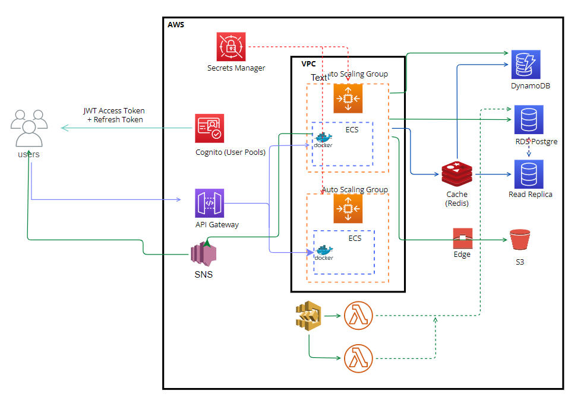

The Quebite Learning System in short is a website where users can create flashcards and quizzes for individual learning that can be share with others. Quizzes in certain formats can be taken in gamified comptetitve sessions. 

The architecture is in between a monolith and a microservice based approach. 

<!--  -->

